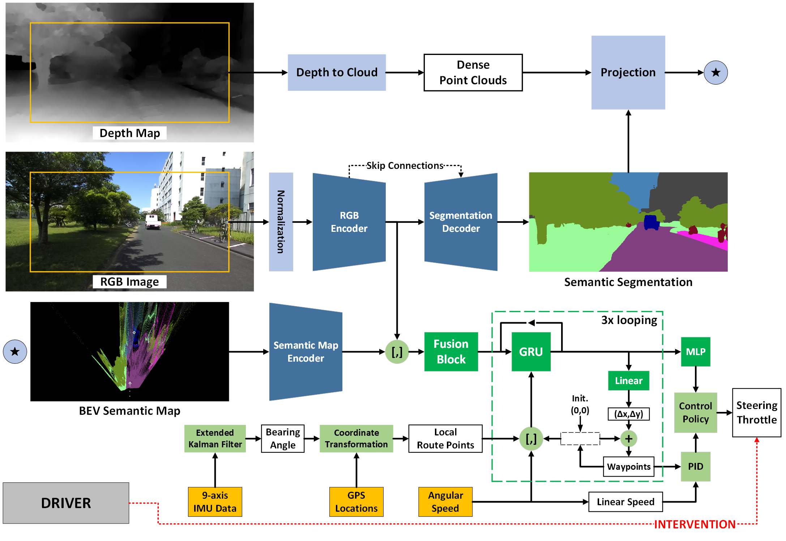

# DeepIPC

O. Natan and J. Miura, “DeepIPC: Deeply Integrated Perception and Control for an Autonomous Vehicle in Real Environments,” IEEE Access, vol. 12, pp. 49590-49601, Apr. 2024.

paper: https://doi.org/10.1109/ACCESS.2024.3385122
video: https://youtu.be/AiKotQ-lAzw

Note:
- DeepIPC --> xr14
- Only for the offline test. For the online test, you need to setup your own vehicle.

Step:
- Open the directory named "xr14". Follow the steps.

ARCHITECTURE:\

AUTO DRIVING:\

