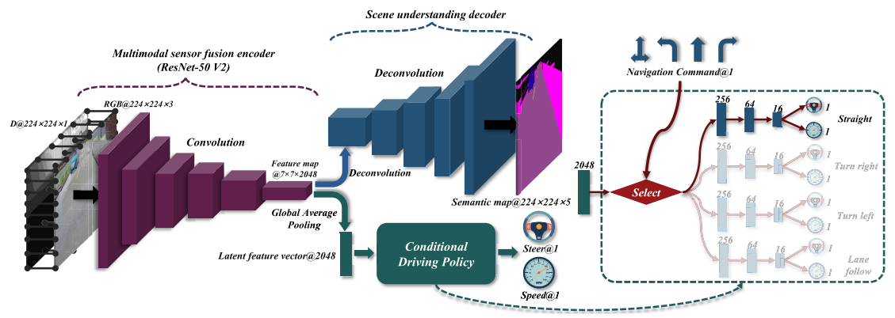
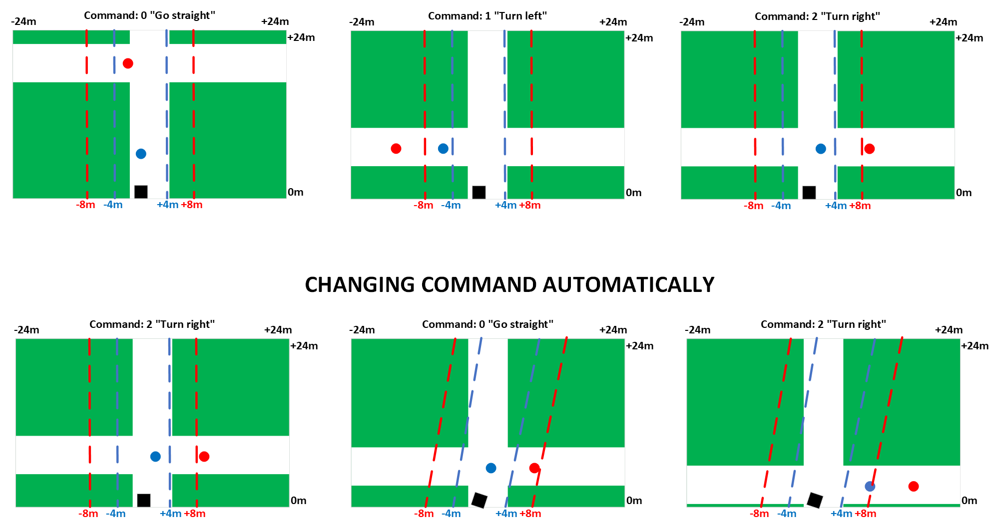

TRAIN-VAL-TEST:
1. Open the config.py file and adjust the dataset directory and other parameters.
2. python3 train.py (you will obtain a .pth file of the model)
3. python3 test.py (you will obtain the score for the offline test)

ARCHITECTURE:\

AUTO DRIVING:\

Local route points to high-level navigational commands:\
